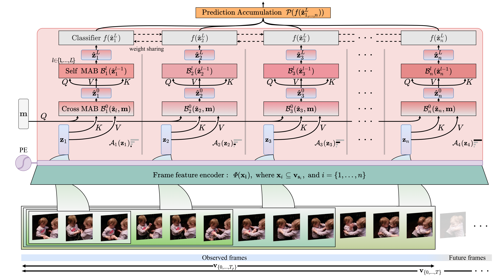

# Progressive Early Action Prediction in PyTorch
### Code implementation for:
Temporal Progressive Attention for Early Action Prediction

- <a href="https://alexandrosstergiou.github.io/project_pages/TemPr/index.html">[Project page]</a>

- <a href="http://arxiv.org/abs/2204.13340">[ArXiv paper]</a>

- <a href="https://youtu.be/rGR5tJUAFpc">[Video]</a>


## Abstract
Early prediction deals with inferring the ongoing action from partially-observed videos, typically at the outset of the video. We propose a bottleneck-based attention model that captures the evolution of the action through progressive sampling over fine-to-coarse scales. Our proposed Temporal Progressive (__TemPr__) model is composed of multiple attention towers, one for each progressive scale. The action prediction is then made through collective agreement considering individual confidences of these attention towers. Extensive experiments over four video datasets showcase state-of-the-art performance on the task of Early Action Prediction
across a range of backbone architectures.
We demonstrate the effectiveness and consistency of TemPr through detailed ablations.


<p align="center">

</p>


## Dependencies

Ensure that the following packages are installed in your machine:

+ `adaPool` (version >= 0.2)
+ `coloredlogs`  (version >= 14.0)
+ `dataset2database` (version >= 1.1)
+ `einops` (version >= 0.4.0)
+ `ffmpeg-python`  (version >=0.2.0)
+ `imgaug`  (version >= 0.4.0)
+ `opencv-python`  (version >= 4.2.0.32)
+ `ptflops` (version >= 0.6.8)
+ `torch` (version >= 1.9.0)
+ `torchinfo` (version >= 1.5.4)
+ `youtube-dl` (version >= 2020.3.24)

You can install the available PyPi packages with the command below:
```
$ pip install coloredlogs dataset2database einops ffmpeg-python imgaug opencv-python ptflops torch torchvision youtube-dl
```
and compile the `adaPool` package as:
```
$ git clone https://github.com/alexandrosstergiou/adaPool.git && cd adaPool-master/pytorch && make install
--- (optional) ---
$ make test
```


## Datasets

A custom format is used for the train/val label files of each datasets:

|`label`|`youtube_id`/`id`|`time_start`(optional)|`time_end`(optional)|`split`|
|-----|------|-----|-----|----|

This can be done through the scripts provided in `labels`


We have tested our code over the following datasets:
- **Somethong-Something (v1/sub21/v2)** : [[link]](https://developer.qualcomm.com/software/ai-datasets/something-something)
- **NTU-RGB** : [[link]](https://rose1.ntu.edu.sg/dataset/actionRecognition/)
- **UCF-101** : [[link]](https://www.crcv.ucf.edu/data/UCF101.php)

#### Conversion of videos to SQLite3

Instead of extracting video frames stored as image files (`.png`/`.jpeg`/etc.) that dramatically increase the number of _inodes_ use, we use `.db` files for each video and store frames as BLOBS.

You can use the `dataset2databse` pypi [package](https://pypi.org/project/dataset2database/) or [repo](https://github.com/alexandrosstergiou/dataset2database) to convert video files to SQL:
```
$ pip install dataset2database
```

#### Data directory format

We assume a fixed directory formatting that should be of the following structure:

```
<data>
|
└───<dataset>
        |
        └─── <class_i>
        │     │
        │     │─── <video_id_j>
        │     │         │
        │     │         │─── frames.db
        │     │         └─── n_frames
        │     │    
        │     │─── <video_id_j+1>
        │     │         │
        │     │         │─── frames.db
       ...   ...
```

## Usage

Training for each of the datasets is done through the homonym `.yaml` configuration scripts in `configs`.

You can also use the argument parsers in `train.py` and `inference.py` for custom arguments.


#### Examples

Train on UCF-101 with observation ratio 0.3, 3 scales and over 4 gpus:
```
python train.py --config config/UCF-101/latents_256/conf.yml --video_per 0.3 --num_samplers 3 --gpus 0 1 2 3
```

Run inference over something-something v2 with TemPr and adaptive ensemble over a single gpu with checkpoint file `my_chckpt.pth`:
```
python inference.py --config config/inference/smthng-smthng/config.yml --head TemPr_h --pool ada --gpus 0 --pretrained_dir my_chckpt.pth
```

#### Calling arguments (for both `train.py` & `inference.py`)

The following arguments are used and can be included at the parser of any training script.

|Argument name | functionality|
| :--------------: | ------- |
| `debug-mode` | Boolean for debugging messages. Useful for custom implementations/datasets. |
| `dataset` | String for the name of the dataset. used in order to obtain the respective configurations. |
| `data_dir` | String for the directory to load data from. |
| `data_dir` | String for the directory to load the train and val splits (should be `train.csv` and `val.csv`). |
| `clip-length` | Integer determining the number of frames to be used for each video. |
| `clip-size` | Tuple for the spatial size (height x width) of each frame.|
| `backbone`| String for the name of the feature extractor network.|
| `head`| String for the name of the attention tower network. Only `TemPr_h` can be currently used.|
| `pool` | String for the predictor aggregation method to be used. |
| `gpus` | List for the number of GPUs to be used. |
| `pretrained-3d`| String for `.pth` filepath the case that the weights are to be initialised from some previously trained model. As a non-strict weight loading implementation exists to remove certain works from the `state_dict` keys.|
|`config`| String for the `.yaml` configuration file to be used. If arguments that are part of the configuration path are passed by the user, they will be selected over the YAML ones.|


## Citation

```
@article{stergiou2022temporal,
title={Temporal Progressive Attention for Early Action Prediction},
author={Stergiou, Alexandros and Damen, Dima},
journal={arXiv preprint arXiv:2204.13340},
year={2022}}
```

## License

MIT
